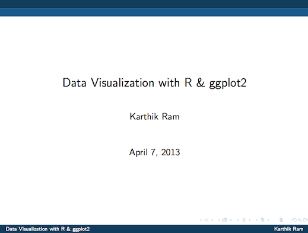

# Introduction to ggplot2

Author: [Karthik Ram](mailto:karthik.ram+ggplot2@gmail.com)

Here are my [slides](https://github.com/karthikram/ggplot-lecture/blob/master/ggplot.pdf?raw=true) for the Spring 2013 R seminar in Integrative Biology at UC Berkeley. The source file is `ggplot.Rnw`. Feel free to modify and reuse as necessary.



To generate the pdf presentation

```
knitr('ggplot.Rnw')
system("pdflatex ggplot.tex")
```

## Suggested readings
* [Elegant graphics for data analysis](http://www.amazon.com/ggplot2-Ele gant-Graphics-Data-Analysis/dp/0387981403/)  
*  [R Graphics Cookbook](http://www.amazon.com/R-Graphics-Cookbook-Winston-Chang/dp/1449316956)

# License  
This work is licensed under a <a rel="license" href="http://creativecommons.org/licenses/by/2.0/">Creative Commons Attribution 2.0 Generic License</a>.
